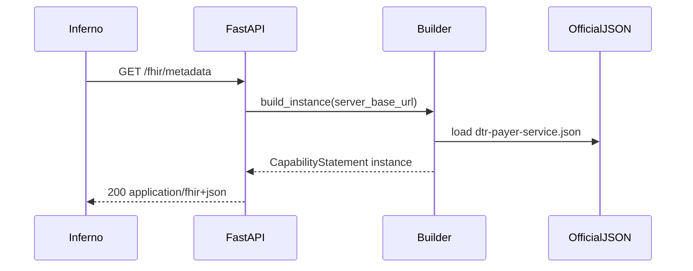

# DTR Payer Server (FastAPI) — Phase 1: Inferno Discovery 1.01

## Goal

Pass **Inferno Da Vinci DTR Payer Server v2.2.0 → Discovery → 1.01** by implementing `GET /fhir/metadata` returning a **valid FHIR R4 `CapabilityStatement`** that advertises all required DTR Payer Service operations.

Inferno’s test logic (authoritative for 1.01) is in the cloned test kit:

```16:69:/tmp/davinci-dtr-test-kit/lib/davinci_dtr_test_kit/server/v2.2.0/dtr_payer_server_capability_statement_test.rb
      REQUIRED_RESOURCE_OPERATIONS = {
        'Questionnaire' => [
          'questionnaire-package',
          'next-question',
          'log-questionnaire-errors'
        ],
        'ValueSet' => ['expand']
      }.freeze
      # ... GET metadata, assert 200, assert_valid_resource,
      # rest.mode == 'server', resource entries + operation names (no leading $)
```

Official operation definitions and `rest.resource` structure come from HL7:

- [CapabilityStatement `dtr-payer-service` JSON](https://hl7.org/fhir/us/davinci-dtr/2.2.0/CapabilityStatement-dtr-payer-service.json) (`kind: requirements`)

**Important:** Do **not** return the IG artifact verbatim (`kind: requirements`). Live servers must return an **`instance`** CapabilityStatement that **instantiates** the canonical requirements statement while reusing the official `rest` block (operations + `definition` URLs).



## Repository layout (clean architecture)

Greenfield repo ([`/home/logidhasan/data/github/dtr_server`](/home/logidhasan/data/github/dtr_server) is empty today).

```
dtr_server/
  pyproject.toml                 # fastapi, uvicorn, pydantic-settings, httpx, pytest
  README.md                      # Inferno inputs + local run
  src/dtr_server/
    main.py                      # FastAPI app factory, mount /fhir
    config.py                    # Settings: public_fhir_base_url, host, port
    domain/
      ports.py                   # CapabilityStatementProvider protocol
    application/
      get_capability_statement.py # use case: build metadata resource
    infrastructure/
      fhir/
        official/
          CapabilityStatement-dtr-payer-service.json  # vendored from HL7 (unchanged)
        capability_statement_builder.py               # requirements → instance transform
        responses.py                                  # FHIR JSONResponse helpers
    presentation/
      api/
        fhir_router.py           # GET /metadata (+ health)
        dependencies.py          # wire use case
  tests/
    unit/
      test_capability_statement_builder.py  # mirror Inferno spec cases
      test_metadata_endpoint.py           # TestClient integration
```

**Dependency rule:** `presentation` → `application` → `domain`; `infrastructure` implements `domain` ports; no FastAPI imports below `presentation`.

## CapabilityStatement design (pass 1.01 + IG validation)

1. **Vendor** the official JSON into [`src/dtr_server/infrastructure/fhir/official/CapabilityStatement-dtr-payer-service.json`](src/dtr_server/infrastructure/fhir/official/CapabilityStatement-dtr-payer-service.json) (exact HL7 content; document source URL + IG version in README).

2. **`CapabilityStatementBuilder`** (infrastructure):
   - Load vendored JSON.
   - Produce **instance** metadata:
     - `kind`: `instance`
     - `instantiates`: `["http://hl7.org/fhir/us/davinci-dtr/CapabilityStatement/dtr-payer-service"]`
     - `implementation.url`: configured public FHIR base (e.g. `http://localhost:8000/fhir`)
     - `implementation.description`: short server label
     - `software` (optional but helpful): name/version from package
     - `date`: build/runtime ISO date (or configurable)
     - **Preserve** `rest[0].mode`, `rest[0].resource` (Questionnaire + ValueSet operations), `fhirVersion`, `format`, `status`, `publisher`/contact as appropriate
     - Remove or replace IG-only fields that confuse instance semantics (`id: dtr-payer-service`, large `text` narrative) while keeping validator-required elements

3. **HTTP surface** ([`presentation/api/fhir_router.py`](src/dtr_server/presentation/api/fhir_router.py)):
   - Mount router at **`/fhir`**
   - `GET /fhir/metadata` → `200` with `Content-Type: application/fhir+json; charset=utf-8`
   - `GET /health` (or `/fhir/health`) for local ops (not used by Inferno)

4. **Config** ([`config.py`](src/dtr_server/config.py)):
   - `PUBLIC_FHIR_BASE_URL` — must match what you enter in Inferno (“Payer FHIR Server Base Url”), e.g. `http://localhost:8000/fhir`
   - Used only to populate `implementation.url` in the CapabilityStatement

## Testing strategy (before Inferno)

Unit tests copied from Inferno’s spec behavior ([`dtr_payer_server_capability_statement_test_spec.rb`](https://github.com/inferno-framework/davinci-dtr-test-kit/blob/main/spec/davinci_dtr_test_kit/dtr_payer_server_v220/dtr_payer_server_capability_statement_test_spec.rb)):

- Pass when all four operations are declared on the correct resource types under `rest.mode == server`
- Fail cases: missing server `rest`, missing `Questionnaire`/`ValueSet` entry, each missing operation

Integration: `httpx.AsyncClient` / Starlette `TestClient` against `GET /fhir/metadata` asserting status, content-type, and operation names.

**Inferno manual check (your milestone):**

- Run DTR Payer Server **v2.2.0** test kit
- Input base URL: `http://<host>:<port>/fhir`
- Run **Discovery** group only → expect **1.01 pass**

Note: `assert_valid_resource` in Inferno uses the Java validator + DTR 2.2.0 IG. If 1.01 fails on validation (not operation names), adjust instance fields (typically `implementation`, `instantiates`, mandatory CapabilityStatement elements) while keeping the official `rest.resource.operation` block intact.

## Phase 2 placeholders (scaffold only, no behavior yet)

Create package stubs and route modules **without implementing business logic** so later Inferno groups have a home:

| Future Inferno group | Route stub |
|---------------------|------------|
| Questionnaire ops | `POST /fhir/Questionnaire/$questionnaire-package`, `$next-question`, `$log-questionnaire-errors` |
| ValueSet | `POST /fhir/ValueSet/$expand` |
| Backend Services | `/.well-known/smart-configuration`, token endpoint (SMART STU2 group in suite) |

Return `501` + `OperationOutcome` for stubs if hit accidentally.

## Deliverables for this phase

- Runnable FastAPI app (`uvicorn dtr_server.main:app`)
- Vendored official HL7 CapabilityStatement JSON
- Instance metadata endpoint satisfying Discovery 1.01
- pytest suite mirroring Inferno operation-declaration checks
- README: Inferno v2.2.0 setup, base URL, running Discovery only

## Out of scope (this phase)

- SMART Backend Services auth (Discovery group does not use auth; suite group 2 does)
- Real `$questionnaire-package` / `$next-question` / `$expand` implementations
- OAuth, UDAP, CORS (add when running full suite from browser-hosted Inferno; operation paths use CORS in the test kit)
